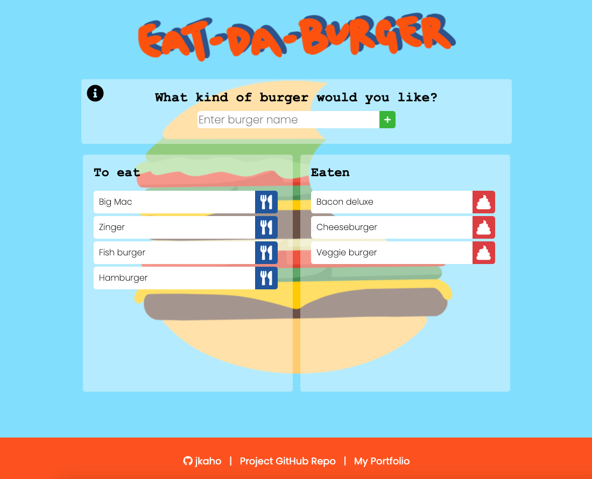
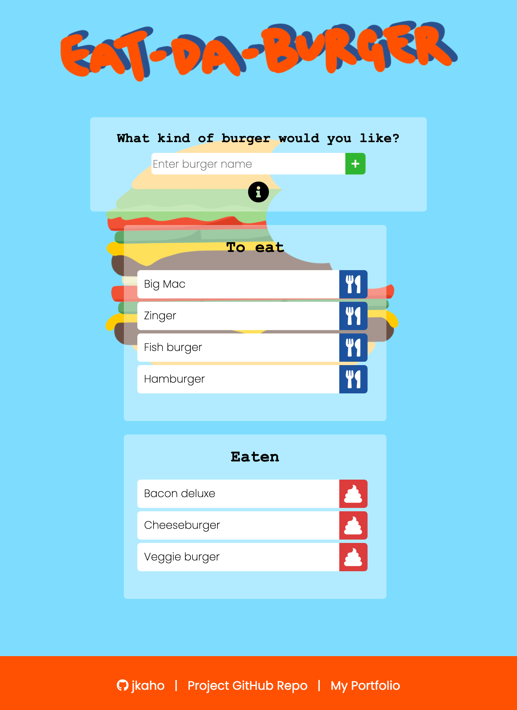
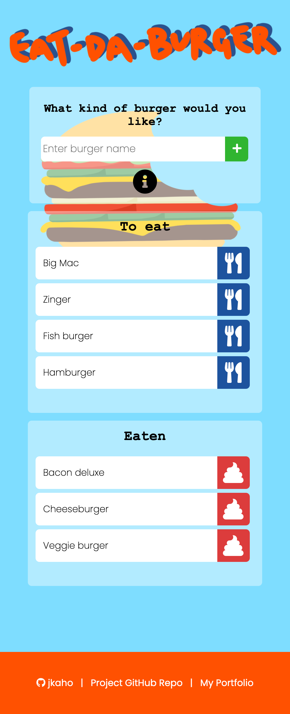

# Eat-Da-Burger!

## Description 

*Eat-Da-Burger!* is a simple application for inputting and storing burger names.

## Motivations

This project was undertaken with the goal to create an application using the Model-View-Controller (MVC) design pattern to separate application logic into methodical parts. 

## Instructions

1. Enter a burger name in the input bar and it will appear in the 'To devour' list.
2. Devour a burger in the 'To devour' list by clicking the blue button next to the burger name, which will then move it to the 'Devoured' list.
3. Burger names can be deleted from the 'Devoured' list by clicking on the red button next to the burger name. 

## Technologies Used 

- Handlebars
- JavaScript
- Node.js
- Express
- SQL 
- MySQL Community Server
- MySQL Workbench
- HTML
- CSS 
- Heroku

## Screenshots

### Large viewport 

### Medium viewport

### Small viewport

## Link

[Link to deployed application](https://jkaho-burger.herokuapp.com/)
