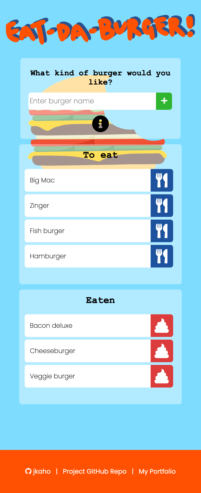

# Eat-Da-Burger

## Description 

*Eat-Da-Burger* is a simple application for inputting and storing burger names.

## Instructions

1. Enter a burger name in the input bar and it will appear on the 'To eat' list.
2. Users can choose to devour a burger on the 'To eat' list by clicking the blue button next to the burger name, which will then move it to the 'Eaten' list.
3. Burger names can be deleted from the 'Eaten' list by clicking on the red button next to the burger name. 

## Technologies Used 

- Handlebars
- JavaScript
- Node.js
- Express
- SQL 
- MySQL Community Server
- MySQL Workbench
- HTML
- CSS 
- Heroku

## Screenshots

### Large viewport 

### Medium viewport

### Small viewport

## Link
